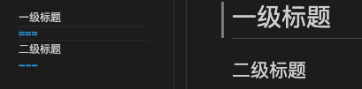
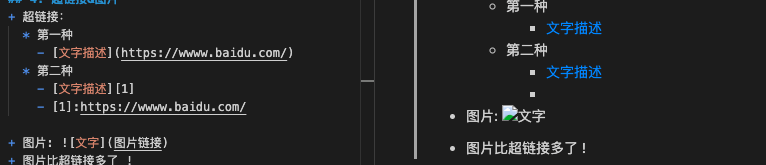
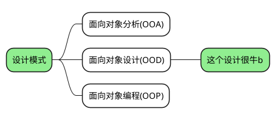
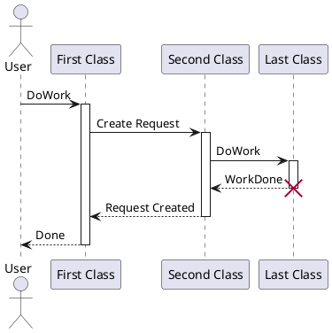
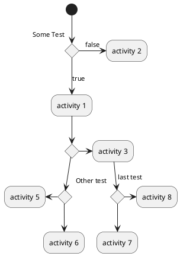

# 语法介绍
## 1. 标题
### 1.1 使用#号表示标题

|一号|二号|三号|四号|五号|六号|
|:---:|:---:|:---:|:---:|:---:|:---:|
|#|##|###|####|#####|######|

### 1.2 用===或者---表示标题



## 2. 分割线
使用3个以上 - 或者 * 表示，且这一行只有符号，注意不要被误识为二级标题。

---
***
## 3. 斜体&粗体&删除线

|斜体|粗体|斜粗体|删除线|
|:---:|:---:|:---:|:---:|
|*|**|***|~~|
|*斜体*|**粗体**|***斜粗体***|~~删除线~~
## 4. 超链接&图片
+ 超链接：
  * 第一种
    - [文字描述](https://wwww.baidu.com/) 
  * 第二种
    - [文字描述][1]   
    - [1]:https://wwww.baidu.com/
  
+ 图片: 
+ 图片比超链接多了 !
## 5. 无序列表
使用"-"、"+"、"*" 表示无序列表,
前面使用tab或者俩个空格进行嵌套
+ 例如

  
## 6. 有序列表
使用过1.（点后空格）表示有序列表，可嵌套
1. 一
   1. 二层
      1. 三层
   2. 二层
   3. 二层
2. 一
## 7. 文字引用
使用 ">" 表示，可以有多个 ">"表示层级
例如
>一层
>>二层
>>>三层
## 8. 行内代码
使用 "`" 包裹表示行内代码

例如
`print("hello,world")`
## 9. 代码块
+ 行首使用四个空格,代码没有高亮

      int main(){
        print("hello,world");
        return 0;
      }
+ 使用 "```" ,代码有高亮
  ``` 
  public class HelloWorld
  {
      public static void main(String[] args)
      {
          System.out.println("hello,world");
      }
  }
  ```
## 10. 表格
|商品|数量|单价|
|-|-------:|:------:|
|苹果|10|\$1|
|电脑|1|\$1000|

第二行表示对齐方式
+ "---:"表示右对齐
+ ":---"表示左对齐
+ ":---:"表示居中
+ "-"表示默认
  
## 11. 流程图
基于插件plantuml，markdown plantuml preview插件
详细需要看plantuml语法，用

思维导图


时序图


流程图

## 12. 数学公式
使用“$”表示，一个“$”表示在行内，俩个“$”表示独占一行
+ 单个“$”使用，前面要有空格
+ 俩个“$”使用，要放在行首
+ "$\ "使用，可以转换数学表达式

eg: $\sum_{i=1}^n a_i=0$

eg: $sum_{i=1}^n a_i=0$

eg:  
$$E=mc^2$$
推荐你一个常用的[数学公式表达网站](https://www.codecogs.com/latex/eqneditor.php)

## 13. 支持html标签

### 1. 例如先那个段落缩进，可以如下
&nbsp;&nbsp;不断行的空白格&nbsp;或&nbsp;

&ensp;&ensp;半方大的空白格&ensp;或&ensp;

&emsp;&emsp;全方大的空白格&emsp;或&emsp;
## 14. 其他

1. markdown 各个IDE的使用可能存在大同小异。